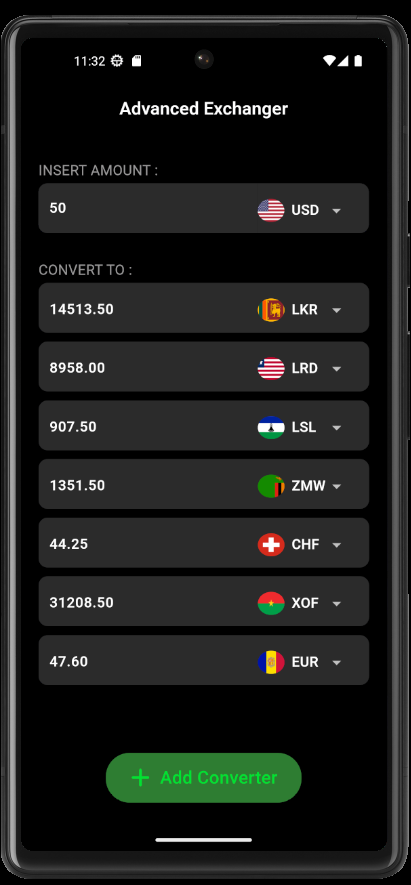

# Currency Converter App

A Flutter application that allows users to convert currencies dynamically with real-time exchange rates. The app follows the **MVVM (Model-View-ViewModel)** architecture, ensuring separation of concerns and scalability. It supports saving user preferences for target currencies using **SharedPreferences**.

## Features

- **Real-time Currency Conversion**: Fetches exchange rates using an external API.
- **Dynamic Currency Converters**: Add/remove multiple target currencies and see real-time conversions.
- **User Preferences**: Saves the preferred target currencies locally and retains them after app restarts using **SharedPreferences**.
- **Light and Dark Themes**: Toggle between light and dark modes for a personalized experience.
- **Deleting Converters**: Drag to left on the converter from the convert to list.
- **MVVM Architecture**: Ensures a clean separation between business logic and UI.

## MVVM Architecture

lib/<br>
├── main.dart                  # App entry point<br>
├── models/                    # Data models for the application<br>
│   └── currency_model.dart    # Currency conversion data model<br>
├── services/                  # API service layer<br>
│   └── api_service.dart       # API calls for fetching currency rates<br>
├── view/                      # UI components and pages<br>
│   ├── common/                # Shared components (themes, colors)<br>
│   ├── components/            # Reusable widgets (e.g., currency input, output)<br>
│   └── pages/                 # Screens (e.g., Currency Convert Page)<br>
├── view_models/               # Business logic and state management (MobX stores)<br>
│   └── currency_store.dart    # Store managing the state of currencies<br>

## Image of the user interface.



## Getting Started

### Prerequisites

- Install the [Flutter SDK](https://flutter.dev/docs/get-started/install).
- Install an IDE like [Visual Studio Code](https://code.visualstudio.com/) or [Android Studio](https://developer.android.com/studio).
- Make sure you have a connected device or an emulator to run the app.

### Clone the Repository

Clone this repository to your local machine using Git:

```bash
git clone https://github.com/lakindugamage/advance_exchanger.git
cd currency-converter
